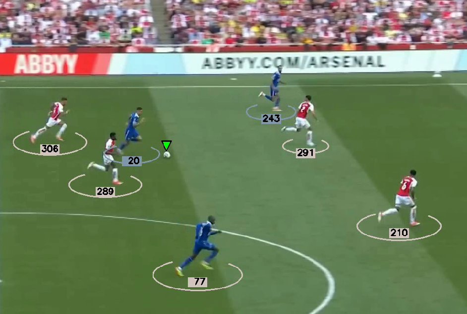

# Football Analysis Project

##Introduction

My main goal for this project is to utilize YOLO, one of the best AI object detection models available, to detect and track players, referees, and footballs in videos. Additionally, I aim to train the model to enhance its performance further.Additionally, I'm exploring the use of Kmeans for pixel segmentation and clustering to assign players to teams based on the colors of their t-shirts. By combining these techniques, I believe I can offer accurate tracking and team identification.

## Modules Used
The following modules are used in this project:
- YOLO: AI object detection model
- Kmeans: Pixel segmentation and clustering to detect t-shirt color

## Trained Models
- [Trained Yolo v5](https://drive.google.com/file/d/1-iVd87Up5FCr2UuERDVipqJBURD9QFF2/view?usp=sharing)

## Warning
Before you begin, ensure that `track_stubs.pkl` is deleted from the `stubs` folder. Additionally, when using a custom input_video, make sure that the players are visible in the first frame and that the camera position remains consistent throughout the entire video.
